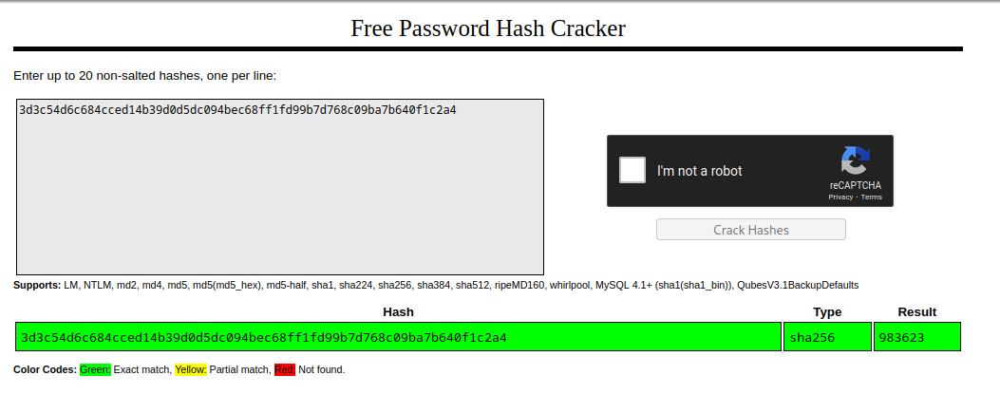
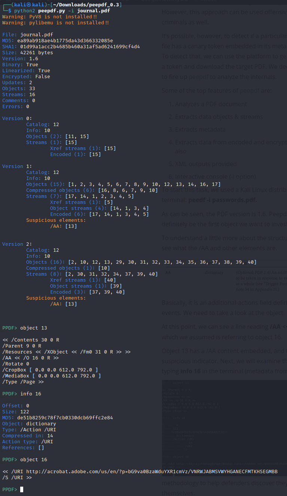
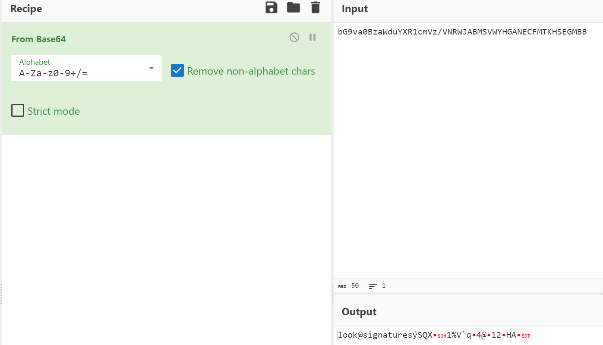
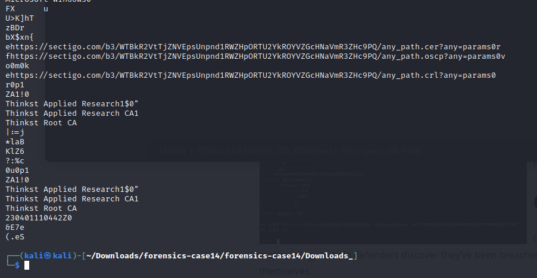
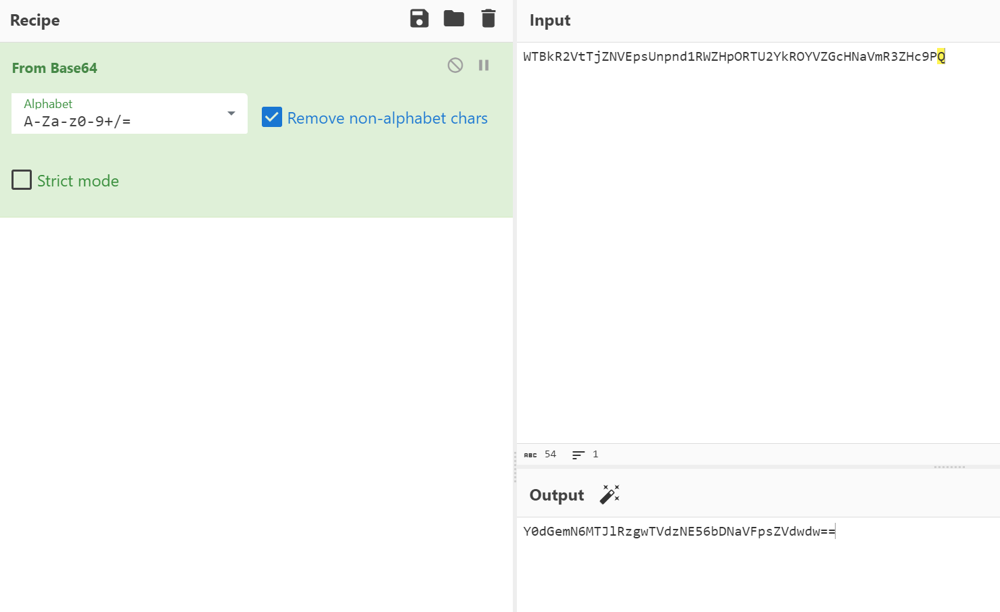
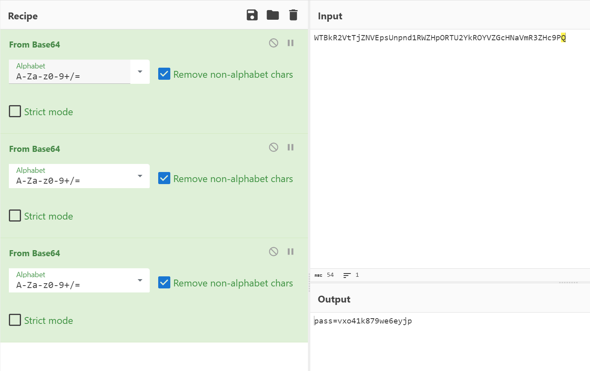

Difficulty: Medium

## Description

A big data leak was detected, and you are assigned to do forensics on some employees data. This particular employee is the major suspect. Moreover, the primary investigation failed to discover the covert-channels used.

File: forensics-case14.zip

## Phase1

Når man åbnede zip filen fik man 2 filer, et hint med et hash, og nogle permissions til passworded, som skal bruteforces.
Man kan smide hashet i https://crackstation.net/ som har hashet liggende.

Vi kan så bruge passwordet til at åbne den næste zip folder.

## Phase2

Når man kommer ind til den næste mappe får man hint2 som fortæller at passwordet ikke kan bruteforces, men at man skal tænke på canarytokens.

#### PDF

Jeg startede ud med at kigge på PDF'en man får givet `Journal.pdf`
Under min undersøgelse omkring canarytokens i pdf'er fandt jeg frem til dette fantastiske tool til at analysere PDF'er: https://github.com/jesparza/peepdf
Du kan læse mere omkring canarytokens i pdf'er her.
https://resources.infosecinstitute.com/topic/how-to-protect-files-with-canary-tokens/

Jeg fulgte hvad de gjorde og fandt det link som bliver lagt i pdf'en nå der generes canarytokens.

Det ligner noget base64 i adobe url'en lad os decode det.
]

Hmmm, "Look@signatures" okay, tid til at kigge på EXE'erne

#### EXE

Canarytokens i exe'er ligger typisk i signaturer og derfor kan vi kigge på hvordan filerner er signerede.
Signaturer indeholder oftest en hjemmeside til hvor de er signerede fra.

Man kan strings exe'erne og se at de indeholder en hjemmeside med noget Base64 kode.

Vi kan så tage det base64 og smide ind i cyberchef og se hvad det giver os.

Vent, det bliver til Base64 igen?
Efter at have smidt 2 ekstra from base64 kan vi endelig se noget rigtigt tekst

okay, vi har vores password til zip filen nu.

`pass=vxo41k879we6eyjp`

## Phase3

Nu har vi endelig fået adgang til den sidste zip mappe, og der ligger en txt fil med nogle tal, samt et billede af en nokia 3310...

`3-3-222 3-33-222-33-7-8-1-888-33_44-0-66-33-999-8-0-55-33-66-7777`

Hvad mon dette kan betyde?

Hvis du er gammel nok, kan du måske huske at man havde mobiler hvor man skal trykke flere gange på et tal for at få et bogstav.

Når du har decoded den gamle nokia encoding, samt smidt det i et flag format får du

`DDC{decept1ve_h0neyt0kens}`
