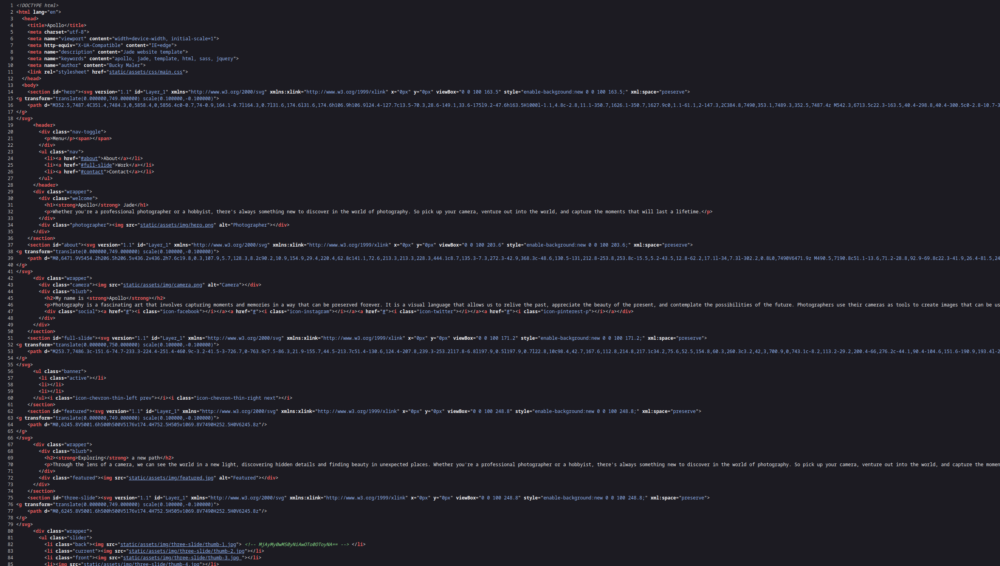
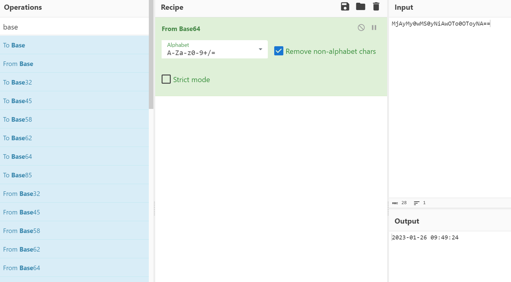
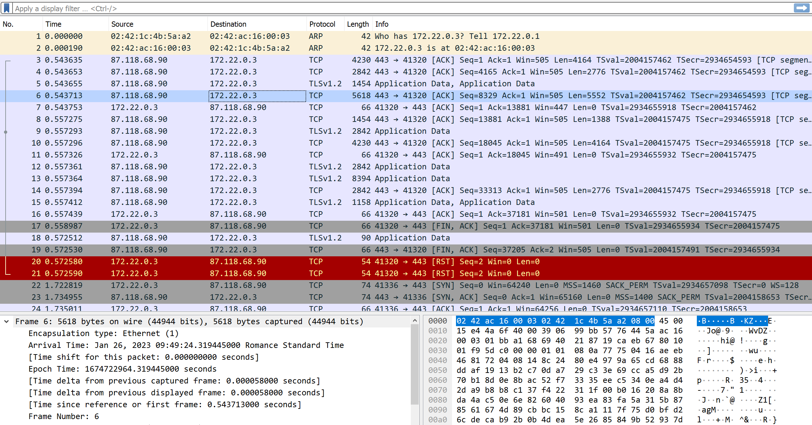

Forensics - Easy

## Description:

Den berømte fotograf Apollo Jade har lige opdaget, at hans hjemmeside er blevet hacket. Netværkstrafikanalysen afslørede, at forbindelsen blev afbrudt abrupt, og Apollo mistænker, at der kan have været nogle mistænkelige aktiviteter. Hackeren efterlod en kryptisk besked i kildekoden, som Apollo tror kan føre til gerningsmandens identitet.

Kan du hjælpe Apollo med at afkode den skjulte besked, identificere eventuel mistænkelig trafik og spore hackerens IP-adresse? Husk, at hackere ofte skjuler tidsstempler for at holde styr på deres aktiviteter. Åh, og glem ikke at tage en tur ned ad floden gennem byens hjerte. Hvem ved, hvad du kan finde der!

Flag format: `DDC{hackerens IP-adresse}`

Du fik udleveret Apollo's hjemmeside og en pcap fil med hans trafik fra serveren

## First step

Hvis vi læser opgave beskrivelsen igennem kan vi læse at hackeren efterlod noget text i kildekoden, så vi kan starte der og finde ud af hvad han har lagt ind.

Hvis vi bare kigger kan vi ikke rigtigt se noget, derfor går vi ind i kildekoden og ser hvad der ligger.
Dette gør vi ved at højreklikke på siden og trykker view-source
aha-

Der er noget grønt som stikker ud mellem alt koden, ligner en kommentar?
men hvad siger den.

Hvis vi kopiere den og smider i cyberchef, så kan det trænet øje nok læse at det er basse64 encoded, ellers virker deres magic tool også godt.
https://gchq.github.io/CyberChef/#recipe=From_Base64('A-Za-z0-9%2B/%3D',true,false)&input=TWpBeU15MHdNUzB5TmlBd09UbzBPVG95TkE9PQ

Nice, nu har vi et timestamp!
Timestamp: `2023-01-26 09:49:24`

## Phase 2

vi kan nu bruge dette timestamp til når vi kigger i wireshark.
Vi åbner wireshark op og loader vores downloadet fil ind i wireshark
Derefter kan vi åbne en af de første packets for at se hvad tid og dag i de er blevet sendt, dette står i tab under packeten

Det ser ud til at vi allerede har fundet den rigtige tid, nice!

Så er det bare at gætte hvilket af de 2 IP'er der er den rigtige

Flag: `DDC{172.22.0.3}`
