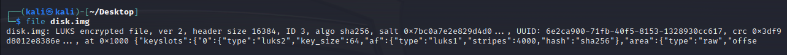
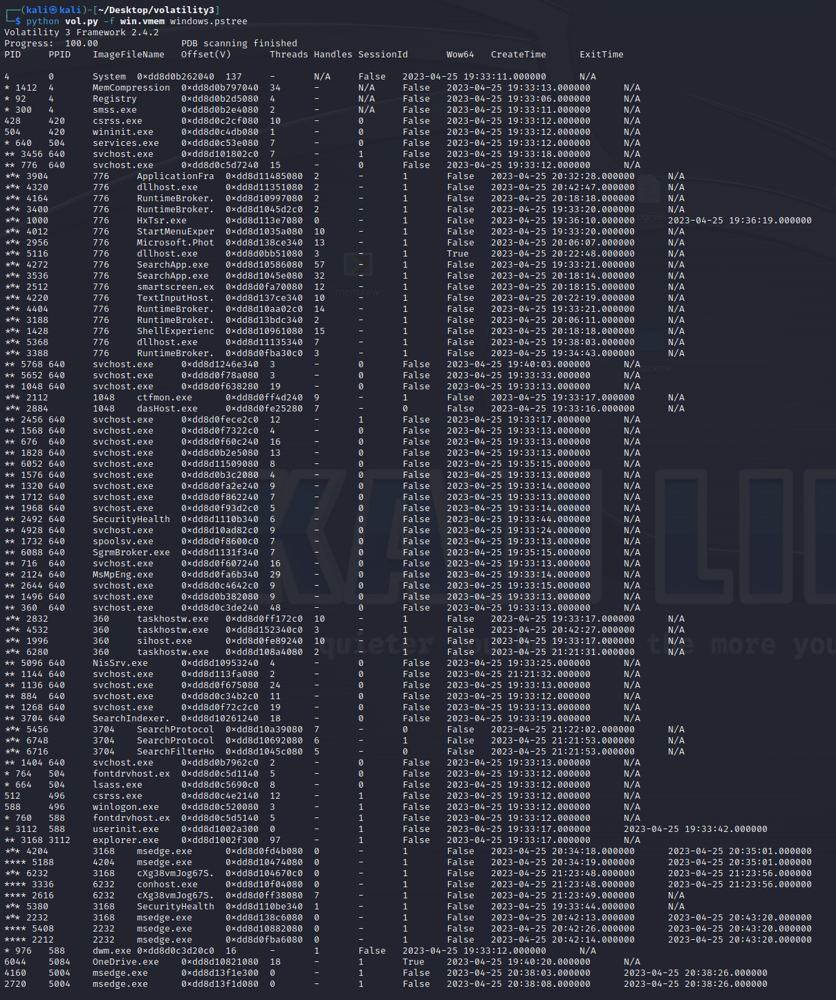
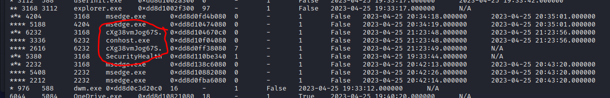
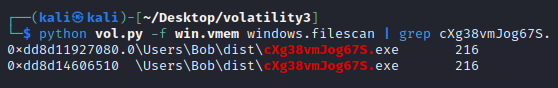
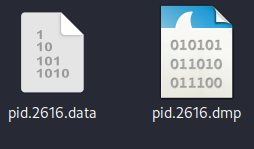
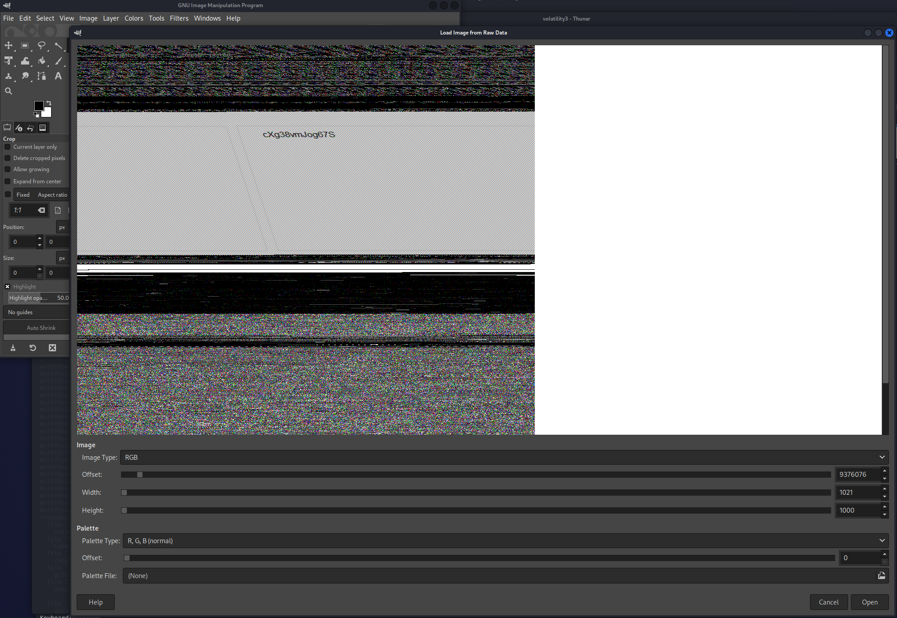
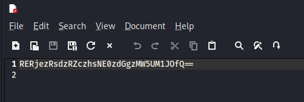
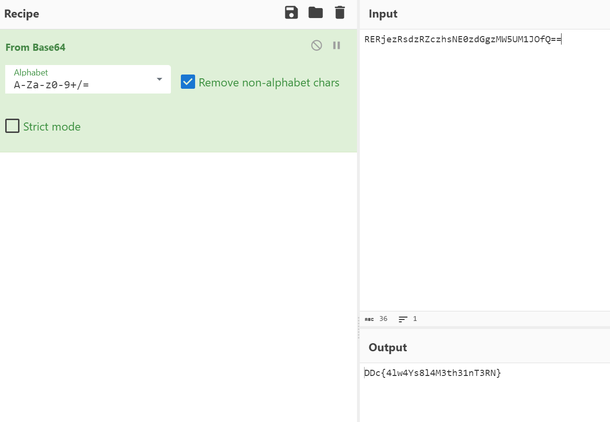

Difficulty: Medium

## Description

Situationen er lidt uheldig. Vi har lidt lavet noget lort, eller rettere sagt, det har vores praktikant. Han arbejdede på én af vores maskiner og pludselig kunne vi ikke få adgang til vores hemmelige dokumenter. Vi havde et drev med dem, og nu er den bare underlig. Måske noget malware??

Jeg læste, at I var ret vilde til det der hacking, så det ville være mega luksus, hvis I kunne prøve at se, om I kan finde vores hemmelige docs? Vores IT-mand lavede et memory dump, ved dog ikke om det er relevant.

Filer vi får givet:
Image disk
Memory dump

Til at starte med kiggede jeg på hvad image disken var da den ikke kunne åbnes i mit disk analyse program, turns out, ved hjælp af `file` commandoen kunne jeg se at det var en LUKS (Linux Unified Key Setup) encrypted disk.

Når jeg prøvede at åbne den spørger disken om et passphrase, hvilket vi ikke har, derfor må vi finde ud af hvordan vi kan komme rundt om passphrasen enten ved at finde den, eller finde master key'en.

hmmmm.

Fandt ud af at man kan extracte masterkey ud fra memory og derfra bypass passphrasen, men efter en del forsøg og noget tid, fandt jeg ud af at man ikke skulle bypass den på den måde...
Hvis du vil vide hvordan man gør det, så fandt jeg denne tutorial
https://blog.appsecco.com/breaking-full-disk-encryption-from-a-memory-dump-5a868c4fc81e

Lad os bruge memory dumpet på en anden måde...

Startede ud med at køre det igennem volatility3 og tjekke pstree

Når man kigger det hele igennem kan man se der er en eller anden process der kører med et tilfædigt navn..

Derefter tjekkede jeg om der var en fil som hed det samme som processen.

Ja da, nå lad os dump filen og prøve at rev den..

Efter endnu en red hearing og tid brugt på at rev exe filen, gav jeg op og prøvede at dumpe memorien fra processen og se hvad den siger.
Kommandoen jeg kørte:
`python vol.py -f win.vmem windows.memmap --dump --pid 2616`

Her får man så en lækker .dmp fil som man bare kan rename til .data da det er en ren data fil.

Et lille trick med memory dumps og rå data filer, de kan nemlig åbnes i GIMP, smart right?

Efter at have åbnet det i GIMP og leget lidt med størrelsen, kan man da se en lille smule
(Selvom Windows kører RGBA virker det bedst i RGB)

Da jeg så at selve navnet stod i memory "billedet" gik det op for mig at navnet nok var passwordet til image disken.

Og det var det.
`Password = cXg38vmJog67S`

Nu til at decrypte disken og mount den så vi kan læse hvad der er på den.

Når vi så har mounted disken, får vi filen secrets.
I filen har vi noget base64 encoded tekst.

Efter en tur i cyberchef får vi endelig flaget:

Vi fikser lige formatet, og sådan first blood!

Flag: `DDC{4lw4Ys8l4M3th31nT3RN}`
